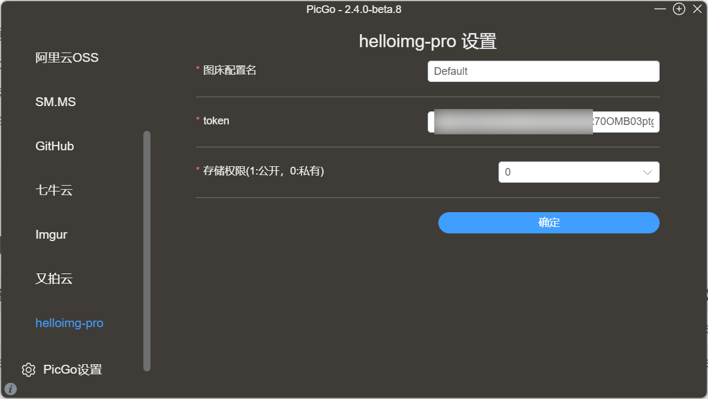

## picgo-plugin-helloimg-pro-uploader

Picgo plugin for https://pro.helloimg.com
为 PicGo 开发的一款插件，适配Hello图床专业版接口。

## 安装
#### 在线安装

	打开 PicGo 详细窗口，选择插件设置，搜索helloimg-pro安装，然后重启应用即可。

#### 离线安装

1. 克隆该项目
2. 打开 PicGo 详细窗口，选择插件设置，并点击如下按钮： 
3. 选择你克隆仓库的文件夹
4. 重启应用即可

### 截图

### 参数说明
|参数名称|类型|描述|是否必须|
|:--:|:--:|:--:|:--:|
|token|input|[Hello图床token](https://pro.helloimg.com/user/tokens)|true|
|permission|list|存储权限(1:公开，0:私有)|true|